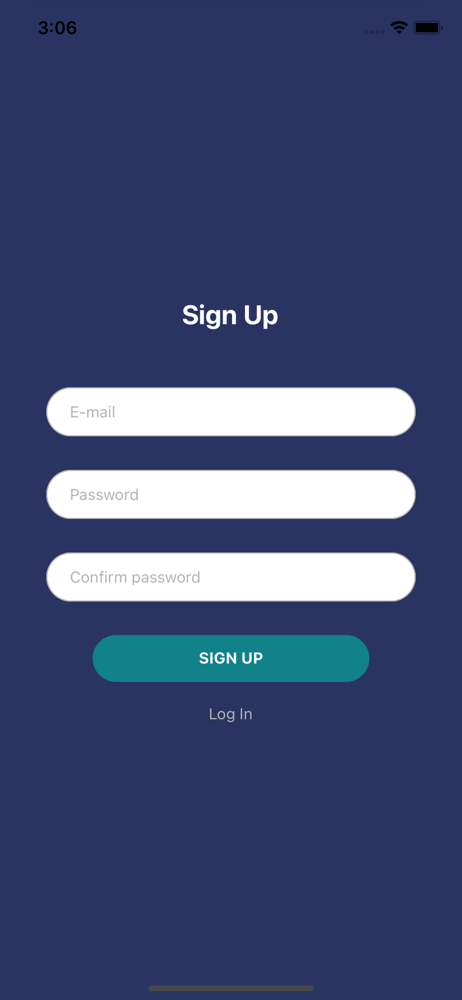
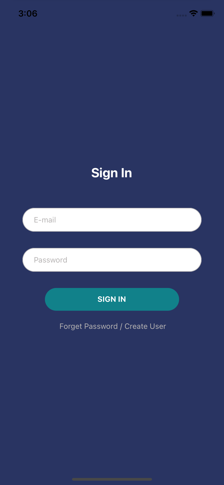
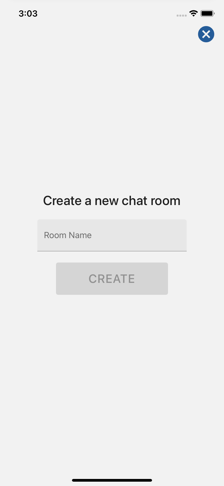
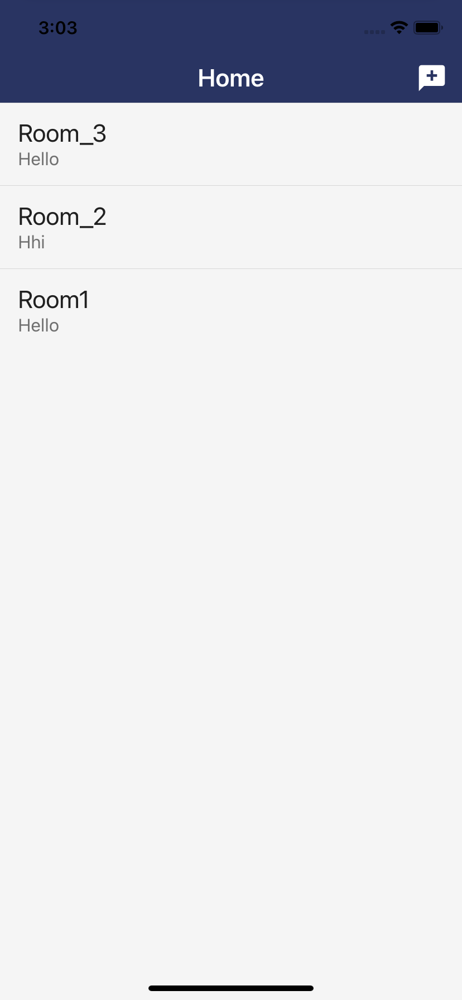
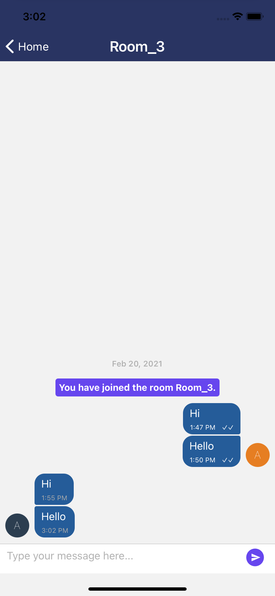

# React Native Chat App Example

- Firebase Email-Password Auth,
- Redux for state management,
- Change password,
- Reset password,
- Toast messages for error or success actions,
- Validate E-mail and password
- React Hook Form
- Mark the message as sent, using one tick
- Mark the message as received, using two tick
- System Message
- Push Notification(For now via the Firebase console)

    
    
    

    
    
    
  

## Installation

- 1- clone app
- 2- `npm install` in terminal project directory
- 3- Install and configure [@react-native-firebase](https://rnfirebase.io/#installation)
- 4- For IOS => go to /ios directory and run => `npx pod-install`

Don't forget [Create a Firebase project](https://console.firebase.google.com) and configure config/firebase.js file in project.

## Usage Libraries

- [React Redux](https://github.com/reduxjs/react-redux)
- [Redux](https://github.com/reduxjs/redux)
- [redux-thunk](https://github.com/reduxjs/redux-thunk)
- [@react-native-firebase](https://rnfirebase.io/)
- [@react-navigation](https://reactnavigation.org/)
- [react-hook-form](https://react-hook-form.com/)
- [react-native-toast-message](https://github.com/calintamas/react-native-toast-message#readme)
- [react-native-vector-icons](https://github.com/oblador/react-native-vector-icons)
- [react-native-gifted-chat](https://github.com/FaridSafi/react-native-gifted-chat)
- [react-native-config](https://github.com/luggit/react-native-config)
- [react-native-paper](https://github.com/callstack/react-native-paper)
- [react-native-push-notification](https://github.com/zo0r/react-native-push-notification)

# Will be added

- Push Notification for messages(Firebase Functions)
- User list for select to chatting
- Sending image, video, document and audio files

## References / Thanks

- [Chat app with React Native](https://amanhimself.dev/blog/chat-app-with-react-native-part-1/)
- [React Native’de Firebase ile Push Notification Gönderimi Nasıl Yapılır?](https://zaferayan.medium.com/react-nativede-firebase-ile-push-notification-g%C3%B6nderimi-8547f3b07ece)
- [React Native’de WebSocket kullanılarak bir chat uygulaması nasıl yapılır?](https://zaferayan.medium.com/react-nativede-websocket-kullan%C4%B1larak-bir-chat-uygulamas%C4%B1-nas%C4%B1l-yap%C4%B1l%C4%B1r-c2597fa5cd8e)

## ERRORS
- [!] CocoaPods could not find compatible versions for pod "react-native-document-picker":
  In Podfile:
    react-native-document-picker (from `../node_modules/react-native-document-picker`)

Specs satisfying the `react-native-document-picker (from `../node_modules/react-native-document-picker`)` dependency were found, but they required a higher minimum deployment target.

Answer]
https://github.com/rnmods/react-native-document-picker/issues/313#issuecomment-802975839

